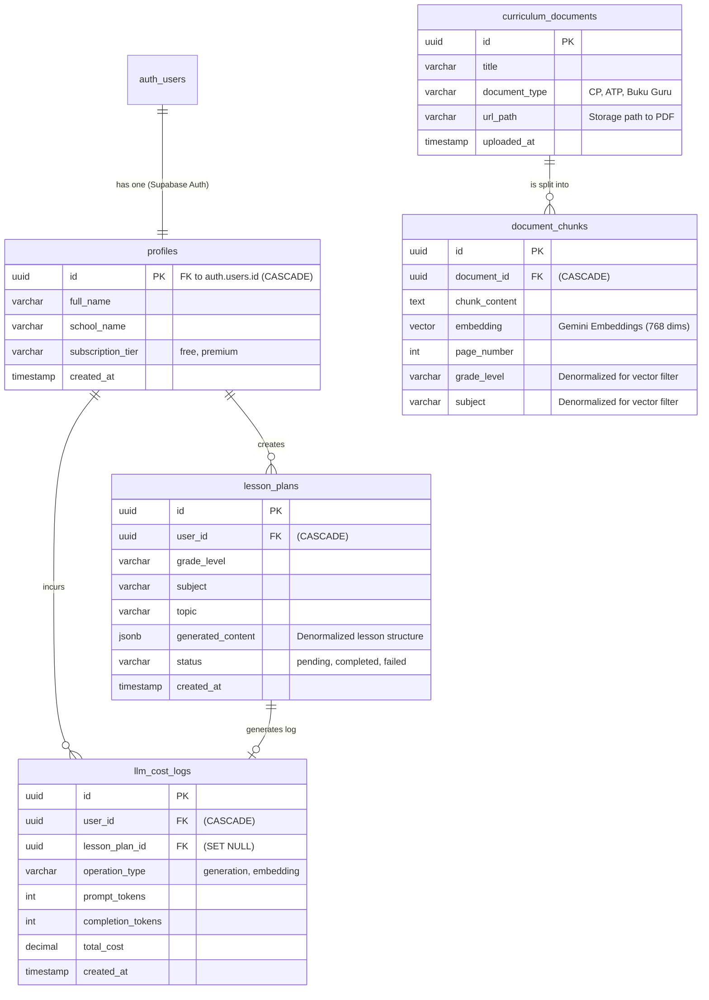

# SARPEBE Backend: Database Architecture

This document outlines the comprehensive database schema design for the SARPEBE (Sistem Automasi Rencana Pembelajaran Berbasis Kurikulum) backend. The database leverages **PostgreSQL (hosted on Supabase)** and utilizes the **pgvector** extension for semantic AI search.

## Entity Relationship Diagram (ERD)

## Table Definitions & Columns

### 1. `profiles`
**Purpose:** Stores application-specific user data.
**Design:** Links 1:1 with Supabase's native `auth.users` table.

**Columns:**
- `id` (UUID, PK): Maps to `auth.users.id`. `ON DELETE CASCADE`.
- `full_name` (VARCHAR): User's displayed full name.
- `school_name` (VARCHAR): The institution the user belongs to.
- `subscription_tier` (VARCHAR): 'free' or 'premium' for quota management.
- `created_at` (TIMESTAMP): Record creation timestamp.

### 2. `curriculum_documents`
**Purpose:** Stores core metadata for official educational standards.

**Columns:**
- `id` (UUID, PK): Unique identifier.
- `title` (VARCHAR): Official name (e.g., "CP Matematika Fase A").
- `document_type` (VARCHAR): Category ("CP", "ATP", "Buku Guru").
- `url_path` (VARCHAR): Storage path in Supabase Storage.
- `uploaded_at` (TIMESTAMP): Ingestion timestamp.

### 3. `document_chunks` (The RAG Engine)
**Purpose:** Stores text segments and mathematical vector representations for AI retrieval.

**Columns:**
- `id` (UUID, PK): Unique identifier for the chunk.
- `document_id` (UUID, FK): Links to `curriculum_documents.id`. `ON DELETE CASCADE`.
- `chunk_content` (TEXT): The extracted text used for LLM context.
- `embedding` (VECTOR): 768-dimensional vector using Gemini Embeddings.
- `page_number` (INT): Used for LLM citations.
- `grade_level` (VARCHAR): Denormalized for fast SQL pre-filtering.
- `subject` (VARCHAR): Denormalized for fast SQL pre-filtering.

### 4. `lesson_plans`
**Purpose:** Stores generated lesson plan drafts linked to the user.

**Columns:**
- `id` (UUID, PK): Unique identifier.
- `user_id` (UUID, FK): Links to `profiles.id`. `ON DELETE CASCADE`.
- `grade_level` (VARCHAR): Target grade.
- `subject` (VARCHAR): Target subject.
- `topic` (VARCHAR): Specific topic.
- `generated_content` (JSONB): The full LLM structured output.
- `status` (VARCHAR): Tracks generation ('pending', 'completed', 'failed').
- `created_at` (TIMESTAMP): Request timestamp.

### 5. `llm_cost_logs`
**Purpose:** Usage analytics and token cost tracking.

**Columns:**
- `id` (UUID, PK): Unique log identifier.
- `user_id` (UUID, FK): Links to `profiles.id`. `ON DELETE CASCADE`.
- `lesson_plan_id` (UUID, FK, Nullable): Links to generation request. `ON DELETE SET NULL`.
- `operation_type` (VARCHAR): 'generation' or 'embedding'.
- `prompt_tokens` (INT), `completion_tokens` (INT): Gemini API token usage.
- `total_cost` (DECIMAL): Calculated fiat cost.
- `created_at` (TIMESTAMP): Call timestamp.

## Advanced Database Concepts

### 1. Indexes & Performance Tuning (pgvector)
To ensure the RAG similarity search remains extremely fast as the dataset grows to thousands of pages:
- **HNSW Index:** We will apply an `HNSW` (Hierarchical Navigable Small World) index on the `embedding` column in `document_chunks` using the vector cosine operator (`vector_cosine_ops`).
- **B-Tree Indexes:** Standard B-Tree indexes will be applied to Foreign Keys (`user_id`, `document_id`) and the denormalized filter columns (`grade_level`, `subject`) to speed up pre-filtering.

### 2. Security (Row Level Security - RLS)
Since the database is hosted on Supabase, we enforce security at the database layer using RLS:
- Users can only `SELECT`, `UPDATE`, or `DELETE` rows in `profiles`, `lesson_plans`, and `llm_cost_logs` where `user_id = auth.uid()`.
- Tables like `curriculum_documents` and `document_chunks` will have `SELECT` access for authenticated users, but `INSERT/UPDATE/DELETE` restricted to admin roles only.

## Architectural Trade-offs

### 1. Metadata Denormalization in Vector Chunks
- **Decision:** Storing `grade_level` and `subject` directly in `document_chunks`.
- **Pro:** Highly efficient pre-filtering (`WHERE grade_level = '4'`) *before* executing vector similarity search, bypassing expensive `JOIN` operations.
- **Con:** Data duplication requires cascading updates if a document's metadata changes.

### 2. JSONB for Lesson Plan Storage
- **Decision:** Storing the entire generated plan in a single `generated_content` JSONB column instead of normalized relational tables.
- **Pro:** Maximum flexibility for changing LLM output formats. The frontend retrieves the entire document structure in a single rapid API call.
- **Con:** Computationally heavier to run analytical SQL queries on deeply nested fields.

### 3. UUIDs over Sequential IDs
- **Decision:** Using UUIDs as Primary Keys across all tables.
- **Pro:** Prevents ID enumeration attacks (essential for multi-user security).
- **Con:** UUIDs consume more storage (16 bytes vs 4 bytes) and can lead to slight index fragmentation over time.

## Querying Rules & Best Practices (SQLAlchemy)

To ensure system stability, prevent race conditions, and maintain high performance, all database interactions within the Repository layer must strictly adhere to the following rules:

### 1. Preventing N+1 Query Issues
- **Context:** Fetching a list of records and then lazily fetching their relationships (e.g., getting 20 lesson plans and then implicitly querying the profile for each) results in N+1 queries.
- **Rule:** Never rely on lazy loading for relationships during list retrievals.
- **Implementation:** Always use SQLAlchemy's eager loading options (`joinedload` for many-to-one, `selectinload` for one-to-many collections) when writing `SELECT` queries in the Repository layer.

### 2. Transactions and ACID Compliance
- **Context:** The RAG generation process involves multiple interdependent database writes (saving the generated draft, deducting the user's quota, and inserting a token cost log). If the process crashes halfway, the database must not be left in a corrupted or partially-billed state.
- **Rule:** Multi-step write operations must be executed atomically within a single transaction block.
- **Implementation:** Use SQLAlchemy's transaction context managers (e.g., `async with session.begin():`). If any step raises an exception, the database will automatically execute a `ROLLBACK`. Only upon successful completion of the block will it `COMMIT`.

### 3. Concurrency and Row-Level Locking (Pessimistic Locking)
- **Context:** In a multi-user environment, a user might double-click a "Generate" button. If they only have 1 generation quota left, a race condition could allow both requests to read "1 remaining" simultaneously, bypassing the limit.
- **Rule:** When reading and modifying state subject to concurrent limits (like user quotas, token balances, or subscription state), you must lock the row.
- **Implementation:** Use `SELECT ... FOR UPDATE` (via SQLAlchemy's `with_for_update()` method) when fetching the profile/quota record. This places a row-level lock in PostgreSQL, forcing any concurrent transaction attempting to read that same row for an update to wait until the first transaction completes.

### 4. Connection Pooling Exhaustion
- **Context:** FastAPI is an asynchronous framework. Under heavy load, it can instantly spawn hundreds of concurrent tasks, each demanding a database connection, which can quickly crash PostgreSQL with a "Too many connections" error.
- **Rule:** The FastAPI application must never connect directly to the raw PostgreSQL instance port (e.g., 5432) in production.
- **Implementation:** Always route connections through Supabase's built-in connection pooler (Supavisor / PgBouncer), which typically runs on port 6543 (IPv4) or using transaction mode. Configure SQLAlchemy's `AsyncEngine` pool settings (`pool_size`, `max_overflow`) to align with the external pooler's capacity.
